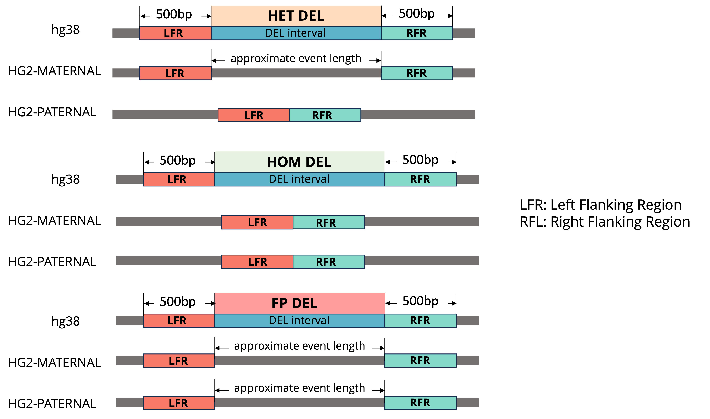

# T2T-ACE
 *A*ccurate *C*NV *E*valuation Using Telomere-to-Telomere Assemblies
 
## Run T2T-ACE
This tool is designed to evaluate the accuracy of CNV calls using the T2T assembly as a reference. 
The tool will align the CNV calls to the T2T assembly and the hg38 assembly and compare the alignment results. 
```
python3 T2T_ACE/run_T2T-ACE.py --cnv_vcf <cnv_vcf> --t2t_ref <t2t_assembly.fa> --hg38_ref <hg38_assembly.fa>
```

## Download Assembly Files
The T2T assembly and the hg38 assembly can be downloaded from the following links:
* [GENCODE](https://www.gencodegenes.org/human/) hg38 primary assembly: https://ftp.ebi.ac.uk/pub/databases/gencode/Gencode_human/release_46/GRCh38.primary_assembly.genome.fa.gz
* [HG002](https://github.com/marbl/HG002) T2T assembly: https://s3-us-west-2.amazonaws.com/human-pangenomics/T2T/HG002/assemblies/hg002v1.0.1.fasta.gz


## Design Description
### DEL evaluation
T2T-ACE align the left and right flanking regions of a DEL variant called in reference genome (hg38) to the HG002-T2T reference.
By calculating the distance between the left and right flanking regions are aligned in HG002-T2T reference, we can determine the correctness and genotype of this DEL variant.

- **Correctness:** If the distance between the left and right flanking regions are aligned in HG002-T2T reference is within the range of 0.8 * (length of the DEL variant) and 1.2 * (length of the DEL variant), we consider this DEL variant is FP.
- **Genotype:** 

- **Het DEL Example:** 
- **Hom DEL Example:** 
- **FP DEL Example:** 

### DUP evaluation
T2T-ACE align the DUP variant called in reference genome (hg38) to the HG002-T2T reference. T2T-ACE aligns the DNA sequence 
representing a DUP variant called in hg38 to the HG002-T2T reference.  

- **Correctness:** 
A TP DUP event is characterized by a higher copy number 
in HG002-T2T than in hg38, while a FP DUP event shows fewer copies in HG002-T2T than hg38. Since the hg38 assembly is haploid, 
and the HG002-T2T assembly is diploid, we assume a copy neutral event has one copy in hg38 and two copies (one for the maternal 
and paternal haplotypes) in HG002-T2T.  A copy is defined as an alignment made by minimap2 where the alignment length is at least 50%
of the query length. This method allows us to identify not only whether a CNV event is correct, but in the case of duplications 
also allows us to identify the precise number, locations, and genotype of duplication events, even if they occur on 
separate chromosomes from the original call on hg38.
- **Hom DUP Example:** 
- **Het DUP Example:** 
- **FP DUP Example:** 
