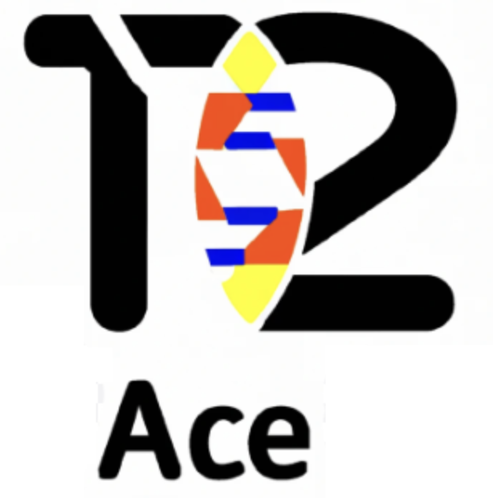

# T2T-ACE
 *A*ccurate *C*NV *E*valuation Using Telomere-to-Telomere Assemblies

## About T2T-ACE

T2T-ACE goes beyond conventional CNV assessment methods. It harnesses telomere-to-telomere assemblies to evaluate CNVs with unmatched precision. This innovative tool utilizes alignment-based techniques, enabling researchers to:

- Determine the correctness of CNV events.
- Identify the precise locations of CNVs.
- Genotype CNV events of interest.

## Key Features

- **Unparalleled Accuracy:** T2T-ACE uses comprehensive telomere-to-telomere assemblies to ensure reliable CNV evaluation.

- **Precision Matters:** Researchers can pinpoint the exact locations of CNV events, providing critical insights 
that can inform mathods or filteting strategies of your CNV caller

- **Genotyping Capability:** Not only can you validate CNV events, but you can also determine their genotypes.

## Design Description
### DEL evaluation
T2T-ACE align the left and right flanking regions of a DEL variant called in reference genome (hg38) to the HG002-T2T reference.
By calculating the distance between the left and right flanking regions are aligned in HG002-T2T reference, we can determine the correctness and genotype of this DEL variant.

- **Correctness:** If the distance between the left and right flanking regions are aligned in HG002-T2T reference is within the range of 0.8 * (length of the DEL variant) and 1.2 * (length of the DEL variant), we consider this DEL variant is FP.
- **Genotype:** 

- **Het DEL Example:** 
- **Hom DEL Example:** 